

 

<h1>Active Directory- High level Installation and Deployment
This is a project showcasing how to set up an active directory environment using microsoft's azure cloud infrastructure. This project will also be accompanied with a full video breakdown linked to my youtube channel.

<h2>Video Demonstration</h2>

 

 
 -Microsoft Azure
 
 -Remote Desktop Protocol
 
 -Windows Server 2022

 Operating Systems Used </h2>

 

<h2>List of Prerequisites</h2>

-Microsoft Azure Account

-2 Virtual Machines

<h2>High-Level Deployment and Installation Steps</h2>

> [!Important]
> Each step will include written instructions and corresponding screenshots. Expand the See Screenshots section to view the images and progress through the portfolio.

<h3>1. Create Windows 11 VM <h3>

So we're going to make our vm using the azure portal. Click on virtual machines and select create new. I'm going to name my vm client1 but if you're following along, you can name your vm whatever you want. Just make sure it's easy enough for you to remember the purpose of each vm. I'm going to place this vm in East US 2 region.

See screenshots

**Notes**
So there's a tab called resource groups and this is where i'm going to put my domain controller and my client1 vm. The reason for this is because it's the only way I can get these two vms to properly communicate with each other. If the vms are in two different resource groups then they won't be able to communicate and I wouldn't be able to join my client to the domanin controller so it's very important to put both virtual machines in the same resource group. I chose the name Active_Directory_Lab for my resource group for ease of use.

See screenshots

For the iso, i'm going to choose the windows 10 operating system. After the iso has been chosen, I'm going to choose a username and password for my login credentials. After I've typed in my credentials, I'm going to continue to the bottom and make sure to check box asking if I have a windows image. 

See screenshots

See screenshots

Next, I'm going to go to the network tab and make sure that both vms that are created are in the same virtual network. If it's not in the same virtual network then they won't be able to communicate with each other when it's time to set up the Active Directory.

See screenshots

So after checking sure that the vm is in the right virtual network, just go to review and create and azure will start a final validation. Once the validation completes, then we can start to create the virtual machine.

See screenshots

<h3> Step 2. Create DC Virtual Machine

Now I'm going to set up the Domain Controller using Windows Server 2022. Click on the virtual machines tab and click create new virtual machine. I named my Domain Virtual machine DC-1. I'm going to choose the Active_Directory_Lab resource group again for this virtual machine. It has to stay in the same resource group as my client1 vm.

See screenshots

See screenshots

Choose a username and password to login with on the virtual machine. Just make sure to write it down in notepad so you don't forget it. After that, go to the bottom of the page and click on the acceptance button

See screenshots

After choosing your credentials, finish up by navigating to the bottom of the page and clicking the license agreement that asks if you have a windows install license. Next click on the network tab and make sure it's in the proper virtual network that the client vm is located in. Now click on review & create and once the validation check has passed, continue to creating your vm.

See screenshots

See screenshots

<h3>Step3. Configure Static IP on Domanin Controller

Once Azure has finished deploying the Windows Server VM, I'm going to go and set it up as a static IP. The reason for this is because I don't need the IP address changing because it'll make it harder for clients that's in the domain to communicate with Active Directory Services if it can't properly connect to the AD Server. In order to do that, I'm going to click on the DC-1 VM and on the next screen, I'm going to double click on the networking tab on the left side of the screen. On the next screen, click on the Networking Security Group.

See screenshots

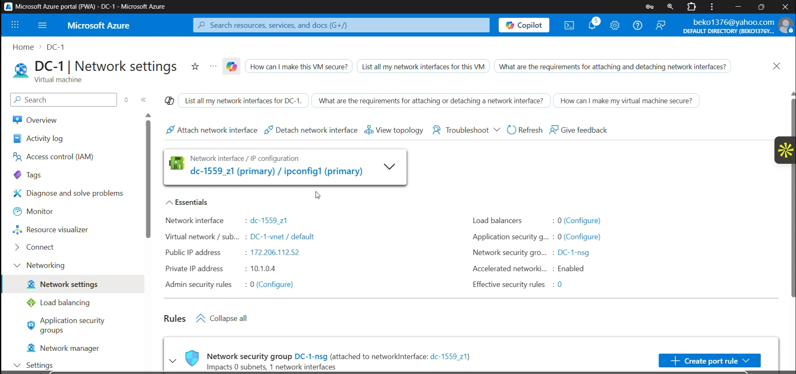

See screenshots

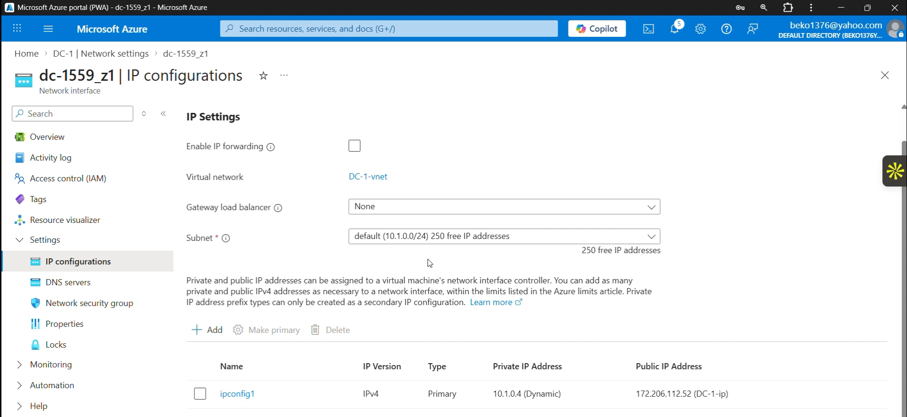

See screenshots

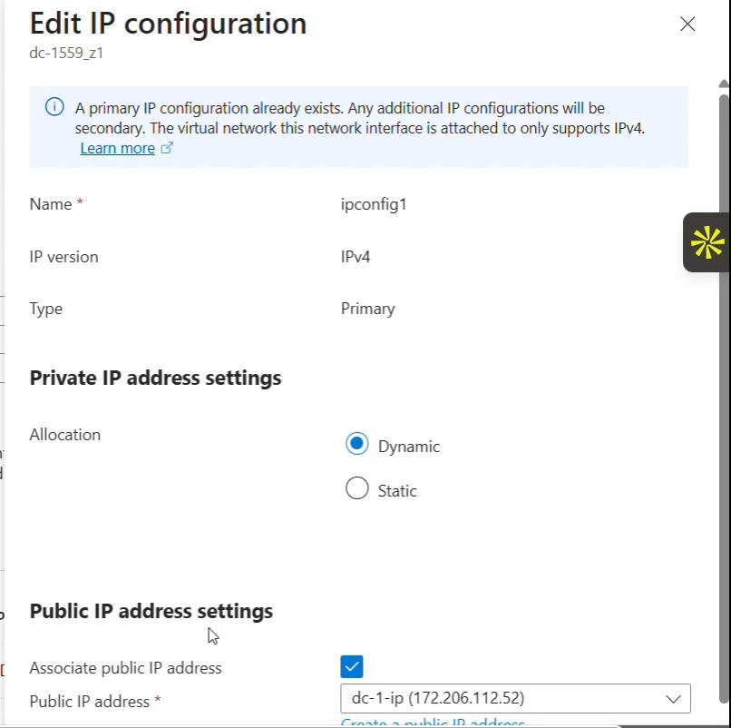

Now that I've turned the ip address of DC-1 machine into a static ip address, I'm going to log into my DC-1 vm. Once logged in, the Windows Server manager will appear and from there, I'm going to turn off the firewall to test the connection to the DC-1 from my windows 10 client machine. Click on tools on the right side of the screen in windows server and slide all the way down until you see windows defender security with advanced firewall settings. After that I'm going to turn off windows firewall defender on the domain profile, public profile, and private profile.

See screenshots

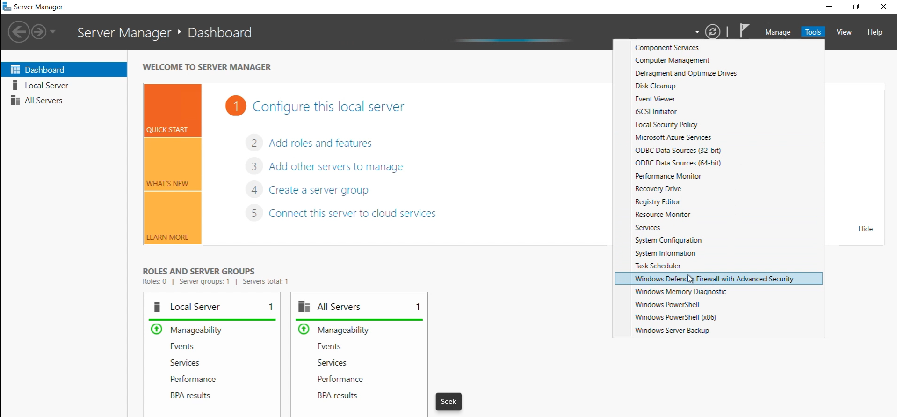

See screenshots

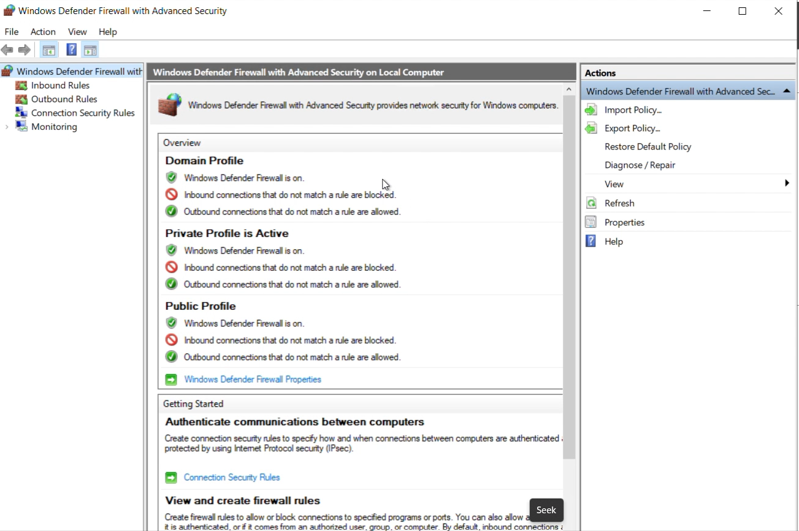

See screenshots

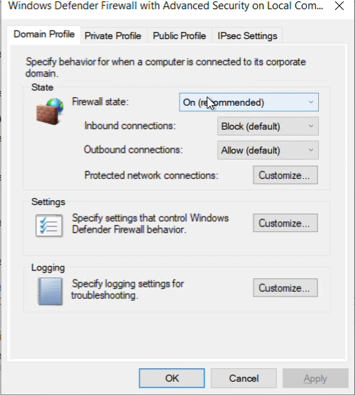

See screenshots

After I turn the firewall off on DC-1, I'm going to configure client1 dns server to point it to my domain controller. I'm going to click on virtual machines in azure and double-click on client1. Next i'm going to scroll to the networking tab on the left side of the screen and click on network settings. After that I'm going to click on the network interface tab and then click on the DNS servers tab. Once I'm in the DNS servers tab, I'm going to check the custom box to change the dns server from the inherited server given by azure. I'm going to point the DNS server to my Domain Controller private IP address.

See screenshots

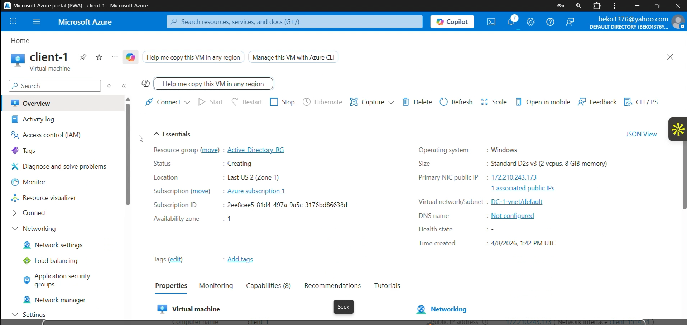

See screenshots

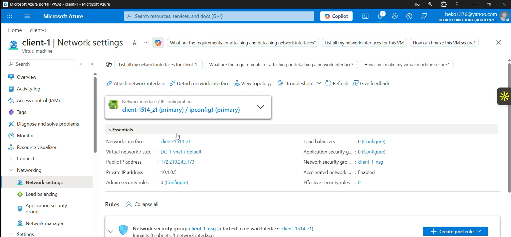

See screenshots

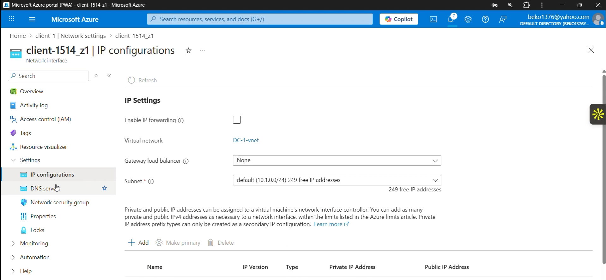

See screenshots

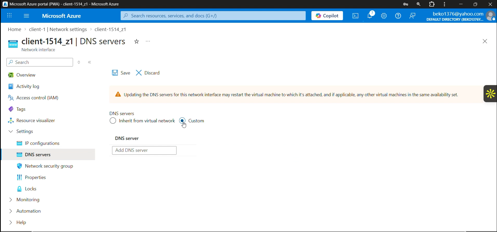

<h3>3. Log into client1
I'm going to get the public ip address of client 1 and remote desktop into the vm. Once inside of client1, I'm going to open powershell and ping my domain controller ip address. It should respond back with 4 replies showing that I'm able to communicate with my domain controller. Next, I'm going to check the and make sure that my DNS server is pointing to DC-1 private ip address. I'm going to type ipconfig /all into powershell. It should bring up the current configurations for my ip. I'm going to look for DNS server and make sure it matches the private ip address of my domain controller. After confirming, It's time to install Active Directory onto my domain controller. 

See screenshots

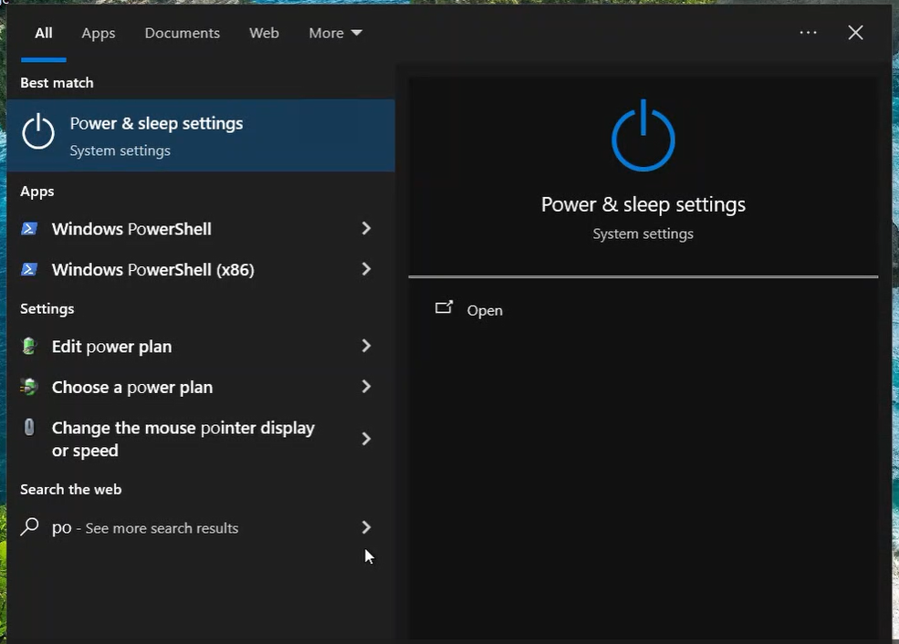

See screenshots

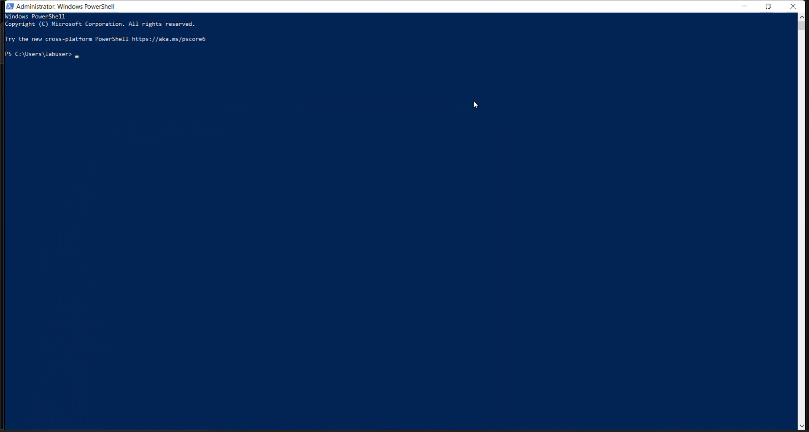

See screenshots

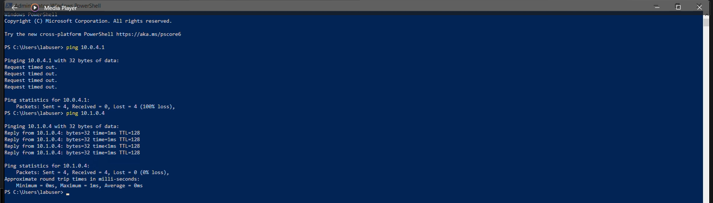

See screenshots

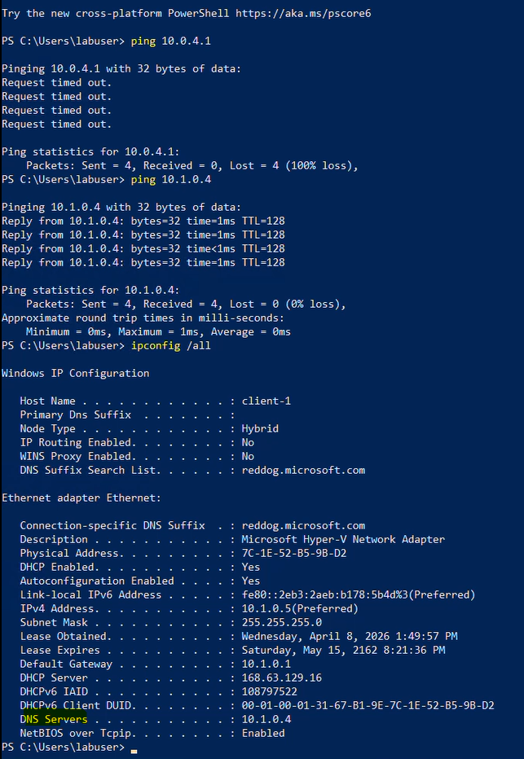

> [!Important]
> I'm going to continue the installation documentation of Active Directory in another portfolio. In order to get the best understanding of the following steps, make sure to read this documentation before continuing to the next portfolio
